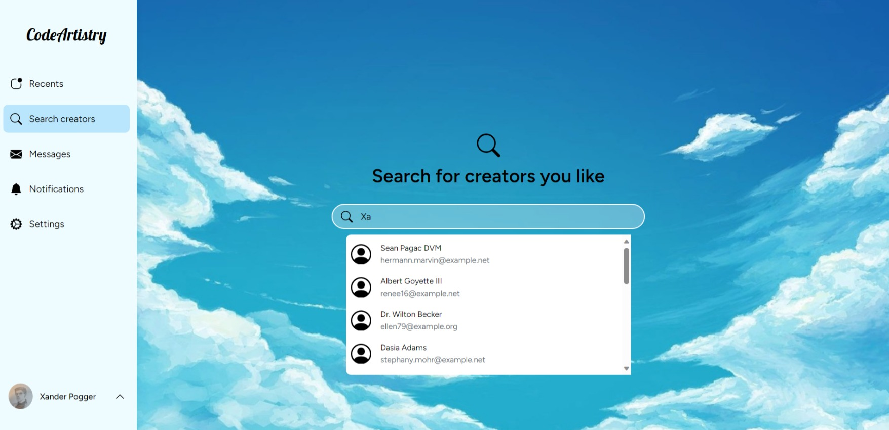
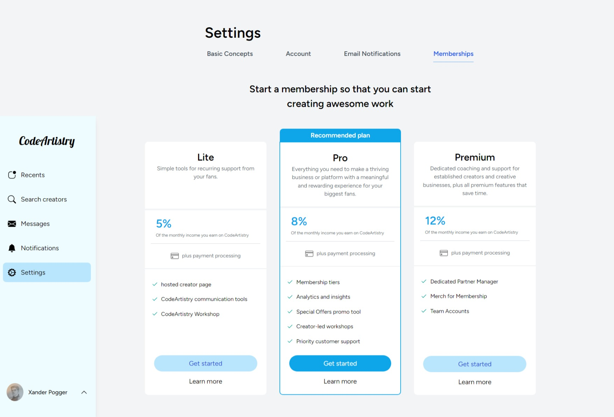

# CodeArtistry online social platform

Xander Poggenklaas

* Art & Drawings
* Membership implementations
* Backend & Front-end development

 

## About this project

I have built this project for my interest and hobby in drawing. When i grew up drawing
was always one of my favourite things to do. Since im now starting a career as 
a future software developer i decided to make an online social platform for
people to post and share there art on.

Im currently working on expanding the website with exciting features of all kinds like:
* A chat messenger system
* Membership functions and features
* Notifications

### Search features

 

### Membership features

## How it functions?

For personal usage you have to be verified and logged in. If you want to post your own art/ media
you will have to have a membership of any of the current options. For people without
a membership it is still possible to view other peoples post and have chat messages.

 

### Tech stack

* Laravel
* Vue js
* php
* javascript

 

Xander Poggenklaas